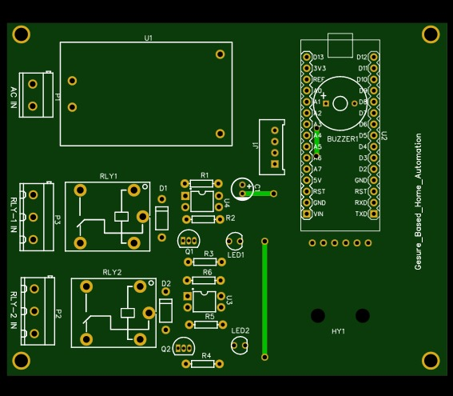

# Gesture-Based Home Automation – PCB Design

## 📌 Overview
This project is a PCB design for a **Gesture-Based Home Automation** System created using EasyEDA. The system uses an **APDS-9960 gesture sensor** and an Arduino Nano to control AC appliances via relay modules. An I²C LCD is used for user feedback, while a buzzer provides alerts. The design includes an onboard HLK-5M05 power supply module for safe AC-to-DC conversion.

## 🛠 Tools Used
- EasyEDA (schematic & PCB design)  

## ⚡Circuit Description

- **Power Supply Unit :-**

1. HLK-5M05B AC-DC converter provides +5V regulated supply.
2. Capacitor C1 ensures filtering.

- **Main Controller:-**

1. Arduino Nano (U2) handles gesture input and relay control.
2. Interfaces with LCD, gesture sensor, relays, and buzzer.

- **Gesture Sensor Module :-**

1. APDS-9960 detects hand gestures.
2. Communicates via I²C (SDA, SCL) and interrupt pin.

- **Relay Circuits :-**

1. Relay 1 (RLY1) and Relay 2 (RLY2) control AC appliances.
2. Driven by BC547C transistors (Q1, Q2) with flyback diodes (1N4007).

- **User Interface :-**

1. I²C LCD Display shows system messages.
2. Buzzer provides sound alerts.

## 📂 Repository Structure
- **schematic And BOM/** → schematic diagram (PDF) And BOM file.
- **pcb_layout/** → PCB layout images  
- **gerber_files/** → Fabrication-ready files for PCB manufacturing  
- **3D View/** → project 3D view images.  

## 🚀 🔧 Features

1. Hands-free gesture control for AC appliances
2. Arduino Nano based control system
3. Dual relay outputs for controlling multiple devices
4. LCD display for real-time feedback
5. Buzzer alerts for status indication
6. Safe onboard AC-DC power supply

## 📸 Project Images
## Top-Layout :

## bottom-Layout :

## Top-3D-View :

## 📄 License
This project is shared for educational and learning purposes.
